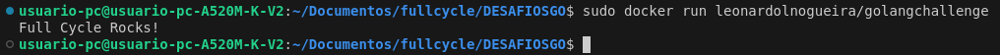
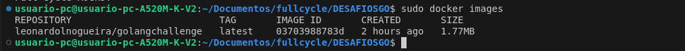

# Desafio Full Cycle - Módulo Docker 🐋: Criar uma imagem golang com apenas 2 MB

## Repositório DockerHub 
    - docker pull leonardolnogueira/golangchallenge

## Para rodar imagem
    - docker build -t leonardolnogueira/golangchallenge:latest .
    - docker run leonardolnogueira/golangchallenge

## Resultados esperado

## Tamanho da imagem com o MultiStage Building

